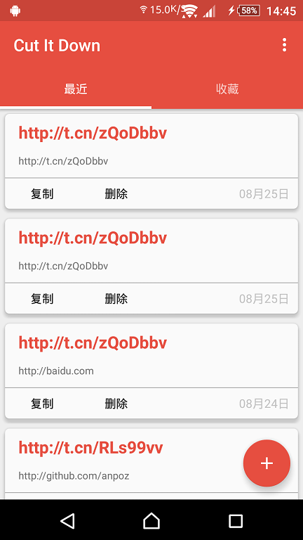
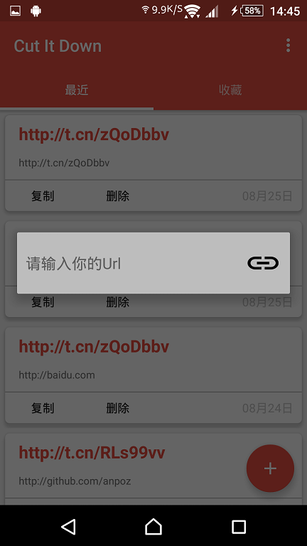
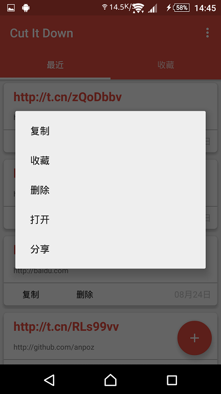
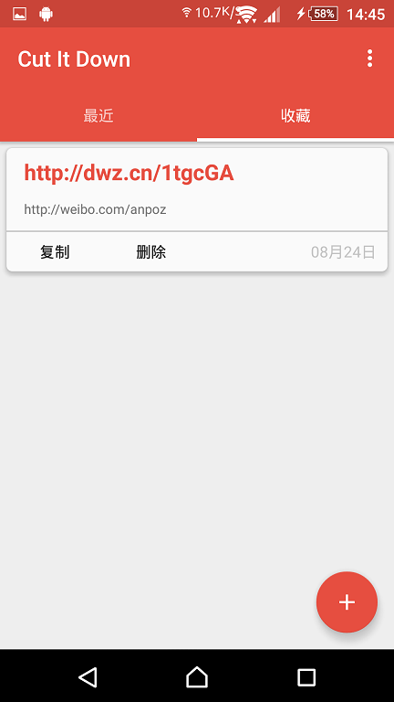
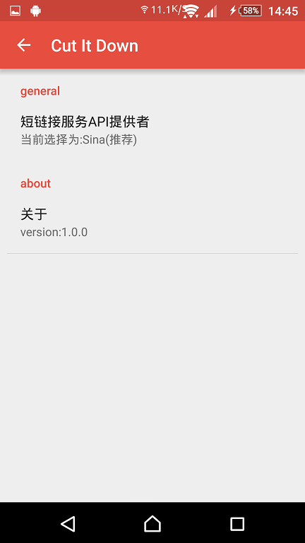

# Cut It Down
短链接生成应用  v1.1.1

这是我做的第一个应用，专注于短链接生成，API可以选择调用[新浪](http://open.weibo.com/wiki/2/short_url/shorten)、[百度](http://dwz.cn/)、[985.so](http://985.so/)还有[is.gd](http://is.gd/),
后续会根据需求添加更多可选的API。

**v1.1.1**
 - 优化内存占用
 - 优化Volley与Activity的生命周期的联动
 - url输入框中加入清除按钮
 - 添加Icon,终于要有Icon了23333~

**v1.1.0**
 - 使用Google Volley框架
 - 替换HttpURLConnection部分，使代码更加简洁，更加优雅
 - 重构网络请求部分
 - future 制作icon

**v1.0.0**
 - Release

  

  

  
